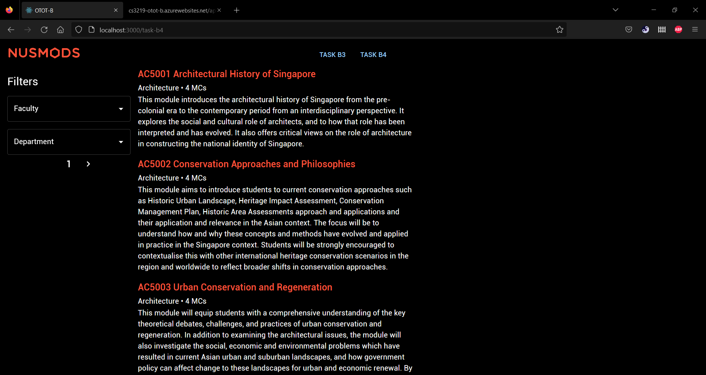

# OTOT Task B

Name: Erin May Gunawan

Matric No.: A0200765L

GitHub Link: [OTOT Task B](https://github.com/erinmayg/OTOT-B)

## Task B1

1. To run the API locally, clone this GitHub repo into your device

   ```bash
   git clone https://github.com/erinmayg/OTOT-B
   ```

   Then from the project root, navigate to the `backend` directory to run the backend.

   ```bash
   # Navigate to backend
   cd backend

   # Run the backend
   npm run start
   ```

   It should produce the following output:

   

   By default, the port is set to `8080`. You can change this by modifying `PORT` variable in `backend/.env` file.

   You can check whether the backend is running correctly by opening `https://localhost:8080/api/characters`

   It should display the following page.

   

2. To test whether the API is working correctly, you can open the [Postman Collection](https://cs3219-g60.postman.co/workspace/dc64e6b3-228c-454c-85b0-39b1454632cd/collection/12707487-c390bf70-9c0b-46c5-81b8-eb31417db8bb?action=share&creator=12707487)

   > however you may need to change the `base_url` to `http://localhost:8080/api/characters` since it is set to the [deployed backend link](https://erinmayg-cs3219-otot-b.herokuapp.com/api/characters) by default

   or you can run test it out manually with the following APIs:

   ### API Requests

   #### GET: http://localhost:8080/api/characters

   Retrieves all characters from the DB

   | Status  | Status | Body                                                                 |
   | ------- | ------ | -------------------------------------------------------------------- |
   | SUCCESS | 200 OK | `{message: 'Characters retrieved successfully', data: CHARACTER[] }` |

   #### POST: http://localhost:8080/api/characters

   Creates a new character

   Request body example:

   ```json
   {
       name: Lumine,
       element: Anemo,
       weapon: Sword,
   }
   ```

   All fields are required, request will fail if there's any missing field.

   | Status  | Status          | Body                                                                                            |
   | ------- | --------------- | ----------------------------------------------------------------------------------------------- |
   | SUCCESS | 200 OK          | `{message: 'New character created', data: CREATED_CHARACTER }`                                  |
   | FAILED  | 400 Bad Request | `{message: 'Missing MISSING_FIELDS'}` or `{message: 'Character with same name already exists'}` |

   #### GET: http://localhost:8080/api/characters/:characterName

   Retrieves the character with the given name from the DB, and displays its info.

   An example of an existing character in the DB is `Zhongli`, so you may replace `:characterName` in the URL with this.

   | Status  | Status        | Body                                                 |
   | ------- | ------------- | ---------------------------------------------------- |
   | SUCCESS | 200 OK        | `{message: 'Character retrieved', data: CHARACTER }` |
   | FAILED  | 404 Not Found | `{message: 'Character not found'}`                   |

   #### PUT: http://localhost:8080/api/characters/:characterName

   Updates an existing character from the DB.

   If you did the [POST](#post-httplocalhost8080apicharacters) request, you may use `Lumine` as the `:characterName`.

   Request param example:

   ```json
   {
    name: Aether
    // element: Dendro
    // weapon: Polearm
   }
   ```

   In this `PUT` request, all fields are optional.

   | Status  | Status          | Body                                                        |
   | ------- | --------------- | ----------------------------------------------------------- |
   | SUCCESS | 200 OK          | `{message: 'Character updated!', data: UPDATED_CHARACTER }` |
   | FAILED  | 400 Bad Request | `{message: 'Character not found'}`                          |

   #### DELETE: http://localhost:8080/api/characters/:characterName

   Deletes an existing character from the DB

   If you did the [POST](#post-httplocalhost8080apicharacters) request, and the [PUT](#put-httplocalhost8080apicharacterscharactername) request, you may use `Aether` as the `:characterName`.

   It returns a successful message and the deleted character upon successful request.

   | Status  | Status          | Body                                                       |
   | ------- | --------------- | ---------------------------------------------------------- |
   | SUCCESS | 200 OK          | `{message: 'Character deleted', data: DELETED_CHARACTER }` |
   | FAILED  | 400 Bad Request | `{message: 'Character not found'}`                         |

## Task B2.1

1. Tests can be run locally via the command

   ```bash
   npm run test
   ```

2. It is also done through the CI in GitHub Actions triggered via a Pull Request or a Push to the `main` branch.

   

## Task B2.2

1. Access the deployed backend API through this [link](https://erinmayg-cs3219-otot-b.herokuapp.com/api/characters)

   It should display the following page

   

2. To test whether the deployed backend is working correctly, you can check via the [Postman Collection](https://cs3219-g60.postman.co/workspace/dc64e6b3-228c-454c-85b0-39b1454632cd/collection/12707487-c390bf70-9c0b-46c5-81b8-eb31417db8bb?action=share&creator=12707487).

   By default, the `base_url` in the collection is set to the [deployed backend link](https://erinmayg-cs3219-otot-b.herokuapp.com/api/characters).

   You can open the Postman documentation to see more details on the API requests and repsonses.

## Task B3

To run the frontend run the following commands:

```bash
# From the project root
# navigate to the frontend directory
cd frontend

# Start the frontend
npm run start
```

By default, it should run in port `3000`, you can open `http://localhost:3000` from the browser.

It should display the following page


> Note that the search function is case-sensitive

### GET


### POST


### PUT


## Task B4

The serverless function is deployed in `Azure Functions` and can be accessed via this [link](https://cs3219-otot-b.azurewebsites.net/api/nusmods?code=WYlD4xbyWJVZBfahxKveRK8fGLCY8AnzdCfhxdcAu8boAzFu64VDCw==).

It should display the following website


It displays all faculties, departments, and modules in NUS (retrieved via the [NUSMods API](https://api.nusmods.com/v2/)) in the AY 2022-2023 (set by default).

And it is able to filter the modules via the department and/or faculties. It employs `AND` filtering between params, and `OR` filtering within it.

A query example would be:
`<azure_functions_link>&faculty=Computing,Science`

### Frontend

To run the frontend, follow the steps listed in [Task B3](#task-b3). Once done, you can navigate to the following [link](http://localhost:3000/task-b4) to view the Frontend for the serverless function.

It should display the following webpage



You can use the drop down to filter the modules


